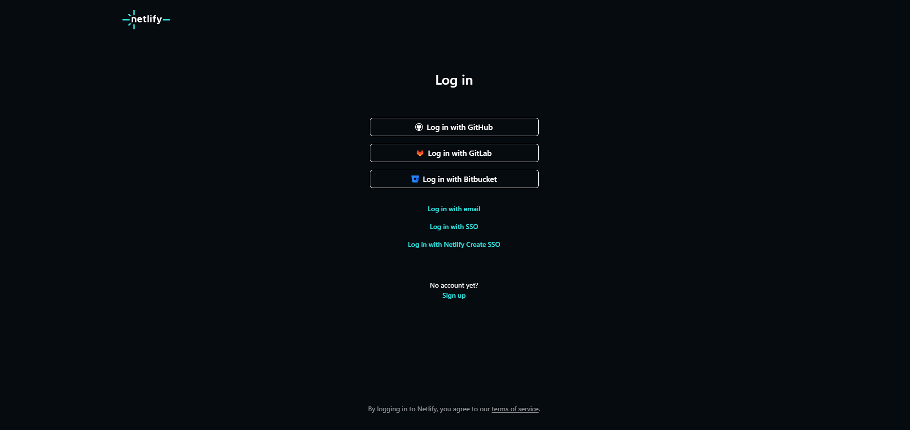
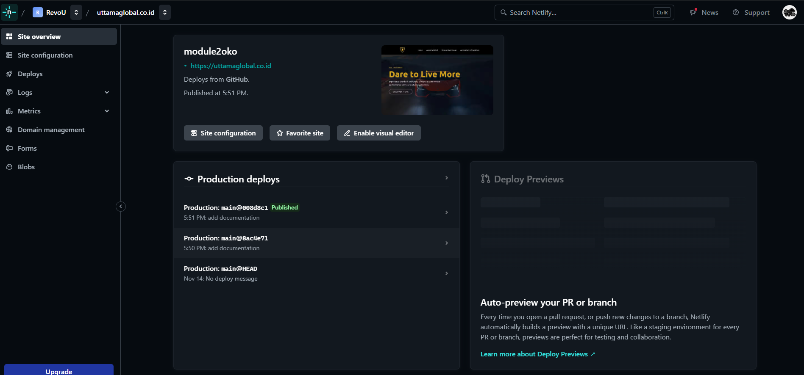
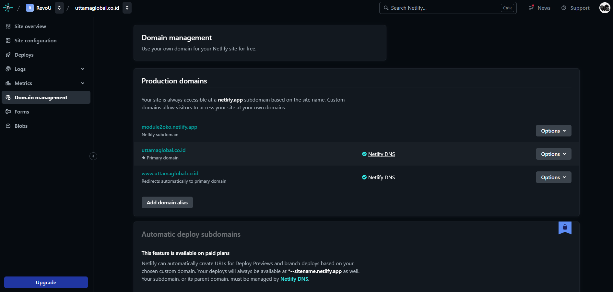
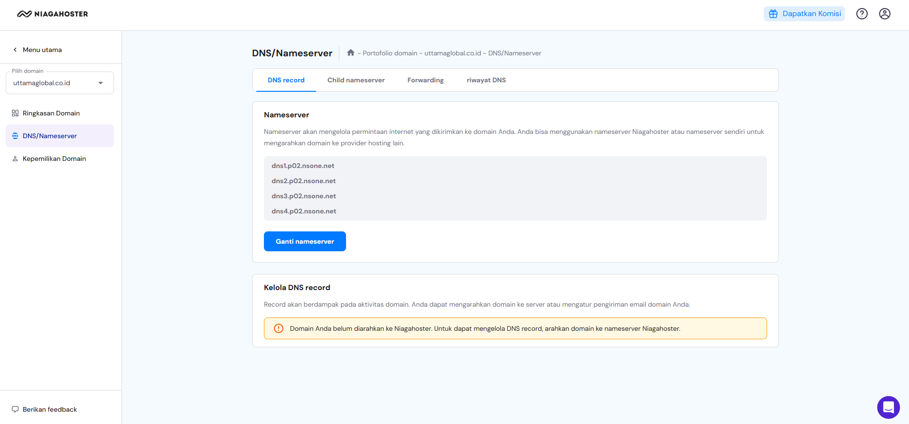

# Project Milestone 1 - Starbucks Company Profile

## Overview
This project is a company profile for Starbucks, showcasing their products, mission, values, and founders. It is designed using HTML, CSS, and JavaScript, with a modern and responsive layout using TailwindCSS. The website includes a carousel of featured products, a section for the company mission and values, a grid of product images, a contact form, and a Google Maps integration showing the Starbucks store location.

## Features
- **Homepage**: Introduction to Starbucks, navigation to key sections.
- **Product Carousel**: Interactive carousel showcasing various Starbucks products with descriptions and prices.
- **Mission & Values**: A section outlining Starbucks' mission and core values.
- **Product Showcase**: Grid display of featured Starbucks products.
- **Founder Section**: Information about the founders of Starbucks with images.
- **Contact Form**: A contact form for visitors to send inquiries.
- **Google Maps Integration**: Embedded map showing the location of a Starbucks store.

## Tech Stack
- **HTML**: The main structure of the website.
- **CSS**: Custom styling using TailwindCSS for a responsive and modern design.
- **JavaScript**: Basic interactivity (e.g., carousel navigation).
- **TailwindCSS**: Utility-first CSS framework for fast and efficient styling.

## Installation

### Setup
1. Clone the repository:
    ```bash
    git clone https://github.com/revou-fsse-oct24/milestone-1-thegoner24.git
    ```
2. Navigate to the project directory:
    ```bash
    cd milestone-1-thegoner24
    ```
3. Open the `index.html` file in your browser:
    ```bash
    open index.html
    ```


## Folder Structure
```bash
/starbucks-profile
│
├── assets/
│   ├── img/
│   │   └── (images for the website)
│
├── style/
│   └── style.css   # Custom CSS
│
├── script.js       # JavaScript for interactive elements
├── index.html      # Main HTML file
└── README.md       # Documentation
```

## Known Issues
Some minor responsiveness issues may appear in older browsers. Ensure you're using a modern browser for the best experience.

# Credits
- Design Inspiration: Starbucks Official Website
- Creator: Guntur Wirayuda (Guntur-RevoU FSSE)


# Deploying Website on Netlify

This guide will walk you through the process of deploying your website on Netlify, from signing up to connecting a custom domain.

---

## Prerequisites

- A GitHub account with your project repository ready.
- A custom domain name.

---

## Step 1: Sign Up on Netlify


1. Go to [Netlify's website](https://www.netlify.com/).
2. Click on **Sign Up** in the top-right corner.
3. Sign up using your **GitHub account** or any other preferred method.
4. Authorize Netlify to access your GitHub repositories.

---

## Step 2: Connect Your GitHub Repository


1. Once logged in, click on **Add New Site** or **New Site from Git**.
2. Select **GitHub** as your Git provider.
3. Authorize Netlify to access your GitHub account.
4. Search for the repository containing your website's code and click **Select**.
5. Click **Deploy Site** to start the deployment process.

---

## Step 3: Enable Auto Deployment

Netlify automatically enables auto deployment after linking your GitHub repository. Any changes you push to the repository will trigger an automatic build and deployment.

---

## Step 4: Connect a Custom Domain 


1. In your site dashboard, go to the **Domain settings** section. 
2. Click **Add Custom Domain**. In this case i'm using **Niagahoster**.
3. Enter your custom domain name and click **Verify**.
4. Update your domain's DNS settings:
   - Alternatively, use the DNS settings provided by Netlify.

5. Wait for DNS propagation (usually a few minutes to a few hours).
6. Once verified, your custom domain will be live!


## Full Deployment

You Can Check [Here!](https://uttamaglobal.co.id/)